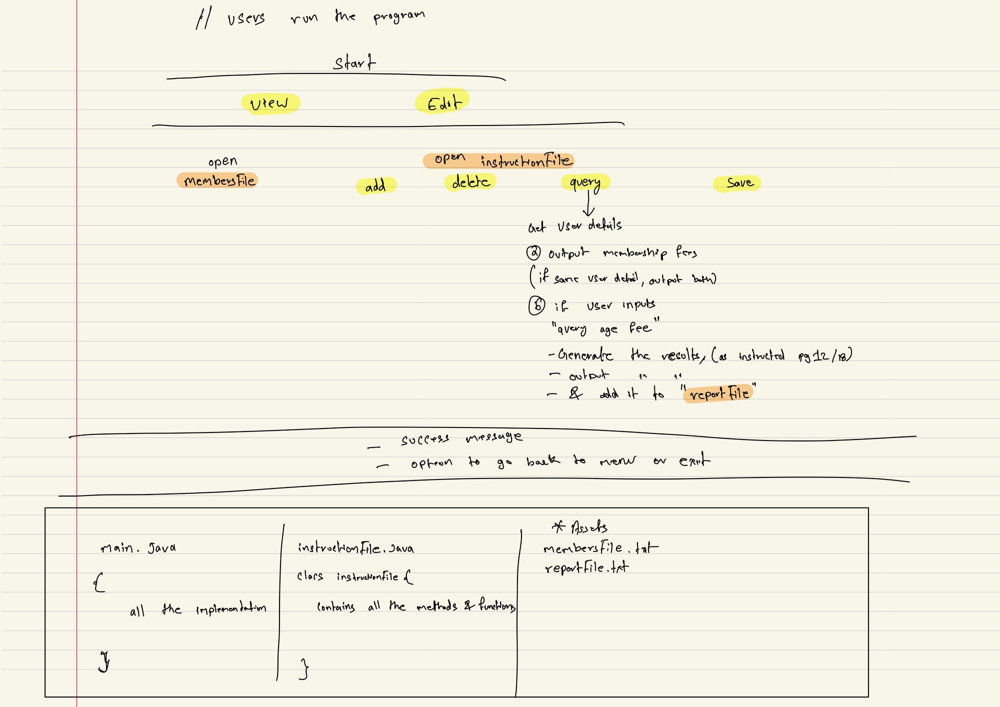

Health Club membership management system (HCMM)
_________________________________________________________________________________________________________________________
This is a group project for the course "Programming and algorithms" 

On successful completion of this assignment, you should have demonstrated that you can:

• Write a program consisting of multiple objects which interact with each other by following appropriate design practices

• Write a program that provides the requested functionality for the system

• Implement classes which have generalization relationships with other classes

• Utilise polymorphism and abstraction techniques

• Utilise appropriate collection classes from Java’s Collections API in appropriate ways/places

• Read data from and write data to text files

• Handle exceptions by constructing try … catch blocks for appropriate circumstances

• Design a text-based user interface
_________________________________________________________________________________________________________________________

Project structure:

Rough draft, proper flow chart will replace this shortly.

_________________________________________________________________________________________________________________________

Documentation:
1. Logic flows: How logic are set and how users are expected to run the program
2. files and folders: How is stored and organised.
3. Naming convention: All the objects, methods and functions

_________________________________________________________________________________________________________________________
